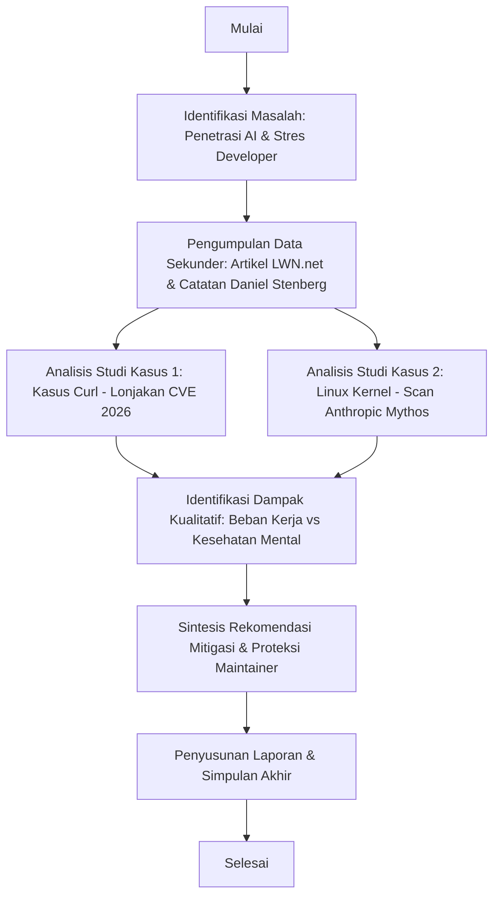

# DRAFT LAPORAN PROJECT-BASED LEARNING (PjBL)
**UNIVERSITAS TEKNOLOGI DIGITAL INDONESIA**

---

## 1. HALAMAN SAMPUL (TEMPLATE)

```
                       PROJECT-BASED LEARNING
             MATA KULIAH: CYBERSECURITY DAN THREAT INTELLIGENCE

             
      ANALISIS DAMPAK PENGGUNAAN TEKNOLOGI AI/LLM TERHADAP 
     KESEHATAN MENTAL DEVELOPER PROYEK OPEN SOURCE (STUDI KASUS:
                   MAINTAINER CURL & LINUX KERNEL)


                               Oleh:
                       MUHAMMAD JEPRI                 - 255410014
                       JUNSO SUAT                     - 215410133
                       BRIDGETTE DIANITA P. L.        - 225410012
                       YOSEFINA EMA                   - 215410113
                       HENDRI AGUNG PERMANA           - 235410035
                       OPAN SAPUTRA NAINGGOLAN        - 225410021


                        PROGRAM STUDI INFORMATIKA
                      FAKULTAS TEKNOLOGI INFORMASI
             UNIVERSITAS TEKNOLOGI DIGITAL INDONESIA
                                YOGYAKARTA
                                  2026
```

---

## 2. HALAMAN PENGESAHAN (TEMPLATE)

```
                        HALAMAN PENGESAHAN

JUDUL PROYEK PjBL   : Analisis Dampak Penggunaan Teknologi AI/LLM 
                      Terhadap Kesehatan Mental Developer Proyek 
                      Open Source (Studi Kasus: Maintainer Curl & 
                      Linux Kernel)
MATA KULIAH         : Cybersecurity Dan Threat Intelligence
PROGRAM STUDI       : Informatika
ANGGOTA KELOMPOK    : 1. Nama: MUHAMMAD JEPRI             NIM: 255410014
                      2. Nama: JUNSO SUAT                 NIM: 215410133
                      3. Nama: BRIDGETTE DIANITA P. L.    NIM: 225410012
                      4. Nama: YOSEFINA EMA               NIM: 215410113
                      5. Nama: HENDRI AGUNG PERMANA       NIM: 235410035
                      6. Nama: OPAN SAPUTRA NAINGGOLAN    NIM: 225410021

Menyatakan bahwa Laporan Project-Based Learning (PjBL) ini telah diperiksa, disetujui, dan disahkan sebagai salah satu syarat pemenuhan tugas mata kuliah Cybersecurity Dan Threat Intelligence pada Program Studi Informatika, Fakultas Teknologi Informasi, Universitas Teknologi Digital Indonesia.


                                            Yogyakarta, 11 Juli 2026
                                            Menyetujui,
                                            Dosen Pengampu Cybersecurity Dan
                                            Threat Intelligence


                                            Yudhi Kusnanto, S.Kom., M.Kom.
                                            NIDN/NIK. ...................
```

---

## 3. KATA PENGANTAR (TEMPLATE)

Puji syukur kami panjatkan ke hadirat Tuhan Yang Maha Esa atas berkat, rahmat, dan karunia-Nya, sehingga kami dapat menyelesaikan laporan tugas *Project-Based Learning* (PjBL) yang berjudul **"Analisis Dampak Penggunaan Teknologi AI/LLM Terhadap Kesehatan Mental Developer Proyek Open Source"** tepat pada waktunya.

Tujuan dari penyusunan laporan ini adalah untuk memenuhi salah satu syarat kelulusan tugas mata kuliah Cybersecurity Dan Threat Intelligence pada Program Studi Informatika Universitas Teknologi Digital Indonesia. Proyek ini mengeksplorasi pergeseran paradigma keamanan siber dengan lahirnya pemindai kerentanan berbasis AI (*AI vulnerability scanner*) dan bagaimana hal tersebut berdampak langsung pada kesejahteraan mental pengembang yang memelihara infrastruktur digital dunia secara sukarela.

Dalam kesempatan ini, penulis ingin menyampaikan ucapan terima kasih yang tulus kepada:
1. Ibu Prof. Dr. LN. Harnaningrum, S.Si., M.T. selaku Wakil Rektor 1 Universitas Teknologi Digital Indonesia.
2. Bapak Yudhi Kusnanto, S.Kom., M.Kom., selaku Dosen Pengampu mata kuliah Cybersecurity Dan Threat Intelligence yang telah memberikan bimbingan, arahan, dan saran-saran berharga selama perencanaan dan penyusunan proyek ini.
3. Rekan-rekan anggota kelompok yang telah bekerja keras dan bekerja sama secara solid di sepanjang semester ini.

Kami menyadari bahwa laporan ini masih jauh dari kesempurnaan. Oleh karena itu, kritik dan saran yang membangun sangat kami harapkan guna perbaikan di masa mendatang. Akhir kata, semoga laporan PjBL ini dapat memberikan manfaat, wawasan, dan inspirasi bagi pembaca.

Yogyakarta, 11 Juli 2026

Tim Penulis

---

## 4. DAFTAR ISI (TEMPLATE)

```
HALAMAN SAMPUL ........................................................................ i
HALAMAN PENGESAHAN ................................................................... ii
KATA PENGANTAR ....................................................................... iii
DAFTAR ISI ............................................................................ iv
DAFTAR TABEL .......................................................................... v
DAFTAR GAMBAR ......................................................................... vi

BAB I PENDAHULUAN ..................................................................... 1
   1. Latar Belakang .................................................................. 1
   2. Rumusan Masalah ................................................................. 3
   3. Tujuan Perencanaan Project Based Learning ....................................... 3
   4. Batasan Masalah ................................................................. 4

BAB II TINJAUAN PUSTAKA ................................................................ 5
   1. Proyek Open Source dan Peran Maintainer ......................................... 5
   2. Large Language Models (LLM) dalam Pencarian Kerentanan Keamanan .................. 6
   3. Stres Kerja, Beban Kognitif, dan Burnout ........................................ 7

BAB III METODE PERENCANAAN ............................................................. 8
   1. Alur Penelitian ................................................................. 8
   2. Penjelasan Tahapan .............................................................. 9

BAB IV HASIL DAN PEMBAHASAN ........................................................... 11
   1. Studi Kasus 1: "The Pressure" pada Proyek Curl (Daniel Stenberg) ................. 11
   2. Studi Kasus 2: Banjir Laporan Keamanan Kernel Linux (Anthropic Mythos) ........... 12
   3. Ketimpangan Kerja AI (AI Labor Asymmetry) ....................................... 13
   4. Dampak Mental: Stres Kronis, Kecemasan Eksistensial, dan Burnout ................. 14
   5. Usulan Kebijakan Mitigasi Burnout ............................................... 15

BAB V PENUTUP .......................................................................... 17
   1. Simpulan ........................................................................ 17
   2. Saran ........................................................................... 18

DAFTAR PUSTAKA ........................................................................ 19
LAMPIRAN .............................................................................. 20
```

---

## 5. DRAFT ISI UTAMA LAPORAN

### BAB I PENDAHULUAN

#### 1. Latar Belakang
Teknologi informasi global saat ini berdiri di atas fondasi perangkat lunak sumber terbuka (*Free and Open Source Software* atau FOSS). Proyek-proyek seperti Linux Kernel dan perangkat pustaka transfer data seperti `curl` ditanamkan di hampir setiap perangkat komputasi di dunia, mulai dari peluncur luar angkasa, infrastruktur perbankan, hingga gawai konsumen. Mayoritas proyek open source ini dikelola secara sukarela oleh sekelompok kecil pengembang (*maintainers*) yang bekerja atas dasar dedikasi, hati nurani, dan kebanggaan profesional.

Namun sejak awal tahun 2026, kemunculan kecerdasan buatan berbasis *Large Language Models* (LLM) seperti Claude Code dari Anthropic telah mengubah lanskap penemuan celah keamanan (*vulnerability discovery*). Dengan menggunakan perintah (*prompt*) yang sangat sederhana, siapapun kini dapat secara otomatis memindai seluruh direktori proyek open source berskala raksasa untuk menemukan kelemahan kode. 

Alih-alih mengurangi pekerjaan pengembang, kemudahan ini memicu fenomena penumpukan kerja yang belum pernah terjadi sebelumnya. Laporan celah keamanan otomatis membanjiri kotak masuk *maintainer*. Banyak laporan yang ternyata merupakan hasil halusinasi AI (*false positives*) atau laporan duplikat berkualitas rendah yang dikirimkan tanpa pemahaman teknis dari pengirimnya. Tekanan psikologis meningkat drastis karena pengembang merasa memiliki kewajiban moral untuk segera memverifikasi dan memperbaiki setiap celah demi menjaga keamanan miliaran perangkat pengguna global. Oleh karena itu, penting untuk menganalisis secara mendalam dampak teknologi AI/LLM terhadap kesehatan mental developer open source sebagai dasar merumuskan kebijakan perlindungan kontributor.

#### 2. Rumusan Masalah
Berdasarkan latar belakang di atas, rumusan masalah dalam PjBL ini adalah:
1. Bagaimana penetrasi teknologi AI/LLM dalam pencarian celah keamanan mengubah beban kerja developer proyek open source?
2. Apa saja dampak psikologis dan mental yang dialami oleh pengembang open source akibat banjir laporan keamanan otomatis berbasis AI?
3. Metode mitigasi dan kebijakan apa yang dapat diterapkan untuk melindungi kesehatan mental *maintainer* di era akselerasi AI?

#### 3. Tujuan Perencanaan Project-Based Learning
Tujuan dari perencanaan proyek pembelajaran ini adalah:
1. Menganalisis secara kualitatif dinamika beban kerja pengembang open source setelah kehadiran pemindai kerentanan berbasis LLM.
2. Mengidentifikasi spektrum gangguan kesehatan mental (seperti kecemasan kronis, beban kognitif berlebih, dan *burnout*) yang dihadapi kontributor open source.
3. Merumuskan rekomendasi kebijakan penanganan laporan berbasis AI yang etis dan ramah terhadap kesehatan mental pengembang.

#### 4. Batasan Masalah
Kajian dalam PjBL ini dibatasi pada ruang lingkup sebagai berikut:
1. Studi kasus berfokus pada dua proyek open source skala besar dan kritis, yaitu proyek `curl` (berdasarkan laporan Daniel Stenberg, 2026) dan Linux Kernel (berdasarkan data pindaian Anthropic Mythos, 2026).
2. Analisis dampak kesehatan mental didasarkan pada studi kualitatif literatur sekunder dari rilis pers, utas diskusi pengembang di forum LWN.net, dan catatan publikasi pribadi *maintainer*.
3. Fokus bahasan adalah dampak psikososial pada pengembang, bukan analisis statistik mendalam mengenai kode pemrograman siber itu sendiri.

---

### BAB II TINJAUAN PUSTAKA

#### 1. Proyek Open Source dan Peran Maintainer
Perangkat lunak open source dikembangkan secara kolaboratif. Pengembang utama yang memegang hak untuk menyetujui dan menggabungkan perubahan kode disebut sebagai *maintainer*. Peran *maintainer* sangat kompleks: mereka bertanggung jawab menguji kode kiriman komunitas, merilis versi terbaru, mengelola komunitas, dan yang paling krusial, mengatasi masalah keamanan. Karena sifatnya yang sukarela, keterbatasan tenaga kerja adalah kendala utama dalam FOSS.

#### 2. Large Language Models (LLM) dalam Pencarian Kerentanan Keamanan
Menurut investigasi Google Project Zero (2024) dan Anthropic (2026), model bahasa besar modern memiliki kemampuan penalaran kontekstual yang kuat untuk menganalisis kode sumber. Dengan perintah sederhana seperti instruksi pemindaian berbasis skrip shell (menggunakan model seperti Claude Opus dan Mythos Preview), pengguna dapat menemukan bug rumit seperti *buffer overflow* atau *use-after-free*. Namun, model ini tetap rentan memproduksi *hallucinated code*—masalah keamanan yang terdengar meyakinkan tetapi secara praktis salah.

#### 3. Stres Kerja, Beban Kognitif, dan Burnout
Dalam psikologi kerja, *burnout* adalah kondisi kelelahan emosional, fisik, dan mental yang disebabkan oleh stres berlebih dan berkepanjangan. Beban kognitif terjadi ketika kapasitas memori kerja manusia kewalahan oleh stimulasi informasi yang datang bertubi-tubi. Bagi pengembang open source, tuntutan untuk selalu siap siaga memperbaiki celah kritis tanpa dukungan finansial atau emosional memicu "sindrom tanggung jawab moral" (*moral responsibility syndrome*) yang mempercepat keputusasaan dan kelelahan mental.

---

### BAB III METODE PERENCANAAN

#### 1. Alur Penelitian (Flowchart)

Berikut adalah flowchart metodologi analisis data dalam proyek PjBL ini:



#### 2. Penjelasan Tahapan
1. **Identifikasi Masalah**: Mengkaji awal fenomena penggunaan AI untuk meluncurkan laporan bug massal ke repositori FOSS.
2. **Pengumpulan Data**: Melacak dokumen resmi rilis siber, esai blog maintainer (*Daniel's blog*), serta komentar-komentar kontributor di portal LWN.net.
3. **Analisis Kasus**: Membagi analisis ke dalam dua kategori: proyek berorientasi utilitas spesifik (`curl`) dan sistem operasi masif (Linux Kernel).
4. **Sintesis Rekomendasi**: Menyusun pedoman bagaimana komunitas menyikapi laporan dari AI agar meminimalkan kelelahan kontributor.

---

### BAB IV HASIL DAN PEMBAHASAN

#### 1. Studi Kasus 1: "The Pressure" pada Proyek Curl (Daniel Stenberg)
Pada Mei 2026, Daniel Stenberg selaku pembuat dan pengembang utama `curl` mempublikasikan tulisan berjudul *"The Pressure"*. Tulisannya menyingkap tekanan luar biasa yang dialami tim keamanan proyek. Menjelang paruh pertama tahun 2026, `curl` mencatat rekor buruk dengan **12 kerentanan terkonfirmasi dalam satu siklus rilis**, memproyeksikan total lebih dari 30 CVE dalam waktu kurang dari enam bulan. Stenberg menekankan bahwa tekanan ini murni bersifat mental: 
> *"Kami merasa berkewajiban untuk memperbaiki masalah keamanan pada perangkat lunak yang kami bantu kirimkan ke setiap perangkat di dunia. Ini bersifat personal bagi kami."*

#### 2. Studi Kasus 2: Banjir Laporan Keamanan Kernel Linux
Daroc Alden (April 2026) melaporkan bahwa bulan Maret 2026 mencatatkan angka laporan CVE tertinggi dalam sejarah industri perangkat lunak dengan total **6.243 CVE baru**. Lonjakan drastis ini dipicu langsung oleh rilis model AI eksperimental baru (seperti Claude Mythos Preview) yang diintegrasikan ke repositori melalui skrip otomatis. Tim riset keamanan Anthropic sendiri memegang kendali atas lebih dari **500 potensi crash kernel Linux** yang belum diverifikasi. Di sisi defensif, Linux Kernel Security Team terpaksa harus merekrut lebih banyak kontributor secara mendadak hanya untuk menanggulangi beban menyaring laporan-laporan otomatis ini.

#### 3. Ketimpangan Kerja AI (AI Labor Asymmetry)
Analisis menunjukkan adanya **asimetri kerja yang timpang**. Seseorang hanya membutuhkan biaya token AI berkisar kurang dari $20 dan skrip shell sederhana sepanjang 5 baris untuk memicu pemindaian massal di ribuan file. Namun, bagi pengembang manusia di sisi penerima:
* Mereka harus membaca ratusan halaman dokumen teknis yang dihasilkan AI.
* Melakukan kompilasi ulang dan pengujian runtime untuk mereproduksi *crash*.
* Melakukan penyaringan manual terhadap laporan palsu yang terdengar sangat ilmiah namun nihil substansi.
* Menghadapi argumen dari pelapor egois yang menggunakan LLM untuk berdebat kusir mempertahankan laporan sampah mereka.

Hal ini memindahkan seluruh beban kerja fisik dan mental dari pencari celah keamanan (*offense*) ke pemelihara sistem (*defense*) tanpa adanya kompensasi tenaga yang sebanding.

#### 4. Dampak Mental: Stres Kronis, Kecemasan Eksistensial, dan Burnout
Dampak kesehatan mental yang teridentifikasi meliputi:
1. **Sindrom Tanggung Jawab Semu**: Rasa cemas konstan bahwa kode yang mereka buat dapat melumpuhkan infrastruktur global jika ada bug terlewat.
2. **Kelelahan Kognitif Akut**: Kejenuhan mental akibat membaca gaya bahasa AI yang seragam, berulang, dan minim keaslian emosional pengirim.
3. **Keputusasaan Eksistensial**: Perasaan bahwa usaha sukarela mereka sia-sia karena jumlah laporan otomatis tumbuh secara eksponensial sementara kapasitas fisik manusia bersifat linier.

#### 5. Usulan Kebijakan Mitigasi Burnout
Untuk menjaga kesehatan mental pengembang, proyek PjBL ini mengusulkan tiga pilar kebijakan mitigasi:
1. **Kebijakan Penyaringan Ketat (Strict Gatekeeping)**: Kebijakan di mana laporan keamanan yang dicurigai sebagai *raw output* AI tanpa verifikasi manusia ditolak secara instan atau didepresiasi prioritasnya.
2. **Inisiatif Project Glasswing**: Mendukung program aliansi industri (didukung Linux Foundation) untuk menyediakan dana langsung bagi kompensasi jam kerja maintainer yang dihabiskan untuk menangani laporan siber.
3. **Penyediaan Asisten Triage AI Terpercaya**: Mempersenjatai maintainer dengan AI pendamping internal (*defensive AI tools*) guna memfilter, mengelompokkan duplikasi, dan menolak draf laporan AI yang keliru sebelum masuk ke kotak masuk manusia.

---

### BAB V PENUTUP

#### 1. Simpulan
Berdasarkan hasil analisis kualitatif dalam proyek PjBL ini, dapat ditarik simpulan:
1. Pemanfaatan AI/LLM dalam pencarian bug telah mengganggu stabilitas ekosistem open source secara drastis melalui peningkatan volume laporan CVE hingga rekor tertinggi pada paruh pertama tahun 2026.
2. Dampak kesehatan mental yang dialami oleh pengembang bersifat nyata dan merusak, ditandai dengan stres akibat tuntutan tanggung jawab moral yang besar, keletihan kognitif, serta kecemasan konstan terhadap serangan *zero-day*.
3. Masalah utama terletak pada ketimpangan kerja (*asymmetry of labor*) antara pelapor yang menggunakan otomasi mesin dan maintainer yang menyaring secara manual.

#### 2. Saran
Adapun saran yang dapat diberikan untuk pengembangan dan penelitian ke depan adalah:
1. Bagi Komunitas Open Source: Segera menetapkan aturan pelaporan yang mewajibkan bukti reproduksi kerentanan secara manual untuk membendung spam AI.
2. Bagi Universitas Teknologi Digital Indonesia (UTDI): Mengintegrasikan kajian etika kecerdasan buatan (*AI Ethics*) dan kesehatan mental pengembang ke dalam kurikulum mata kuliah rekayasa perangkat lunak.
3. Bagi Peneliti Selanjutnya: Melakukan studi kuantitatif klinis berupa penyebaran kuesioner stres kerja langsung kepada para pengembang aktif FOSS guna mendapatkan data kesehatan mental yang lebih presisi.

---

## 6. DAFTAR PUSTAKA (GAYA PENULISAN UTDI)

Alden, Daroc, 2026, *A flood of useful security reports*, LWN.net, https://lwn.net/Articles/1066581/ (diakses pada 8 Juli 2026 pukul 21.05 WIB).

Corbet, Jonathan, 2026, *Stenberg: The pressure*, LWN.net, https://lwn.net/Articles/1074449/ (diakses pada 8 Juli 2026 pukul 21.05 WIB).

Stenberg, Daniel, 2026, *The Pressure*, Daniel's Blog, https://daniel.haxx.se/blog/2026/05/26/the-pressure/ (diakses pada 8 Juli 2026 pukul 21.10 WIB).

Google Project Zero, 2024, *Project Naptime: Evaluating LLMs on Vulnerability Research*, Project Zero Blog, https://projectzero.google/2024/06/project-naptime.html (diakses pada 8 Juli 2026 pukul 21.15 WIB).
